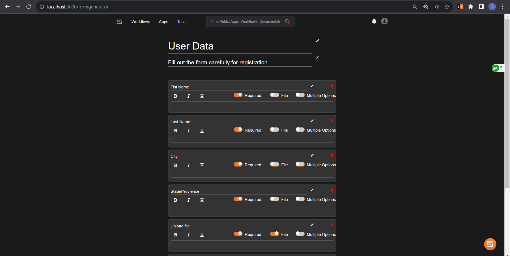
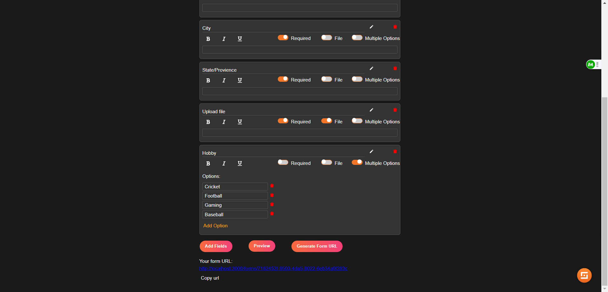
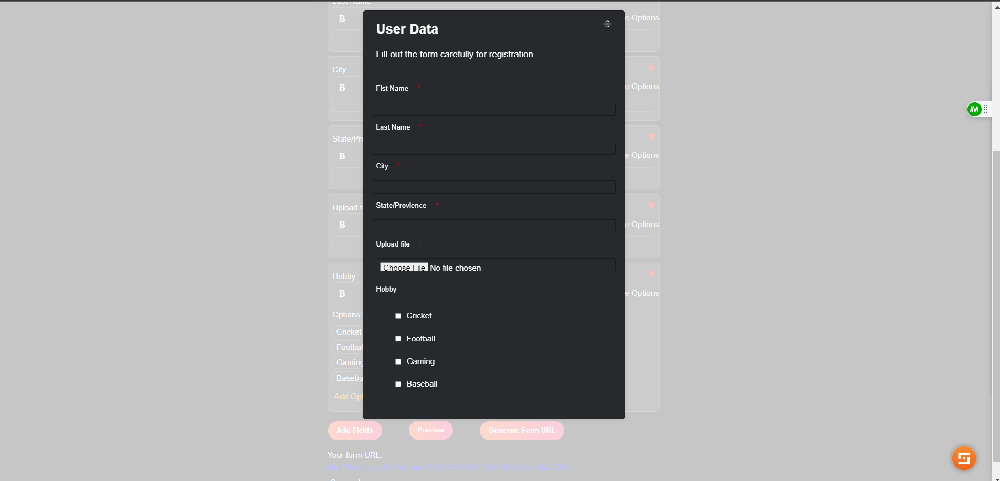
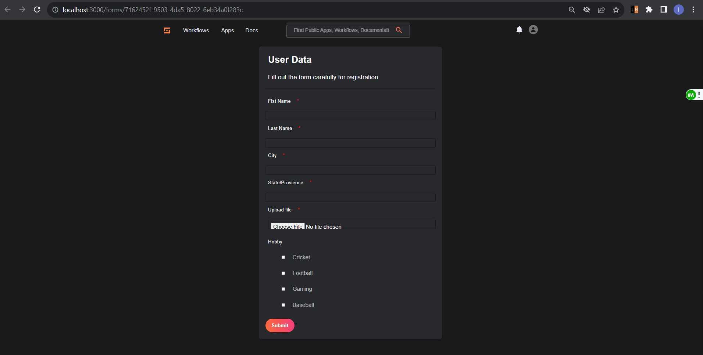
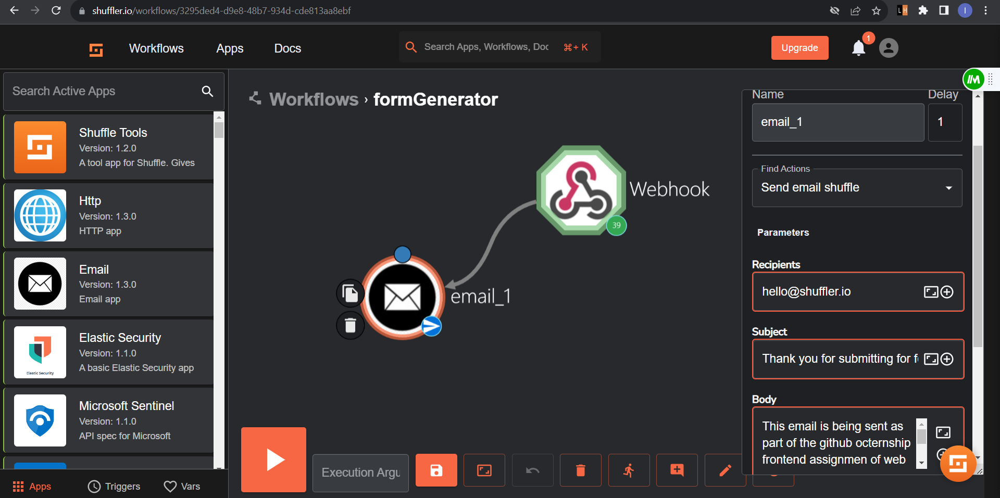
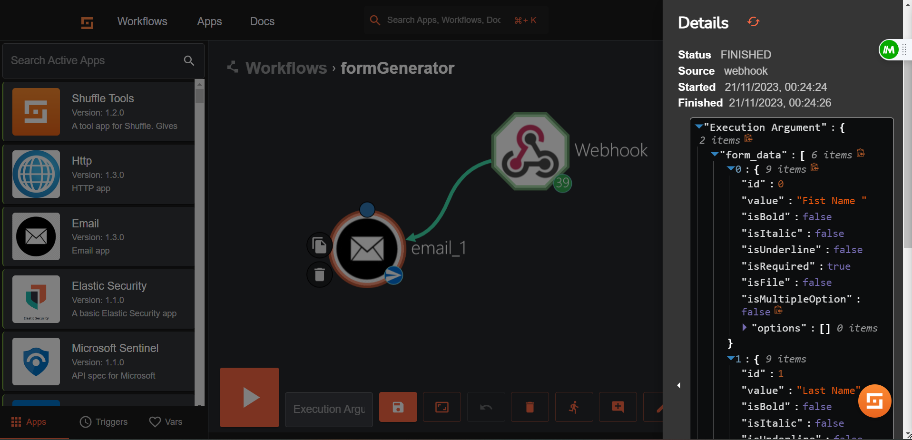
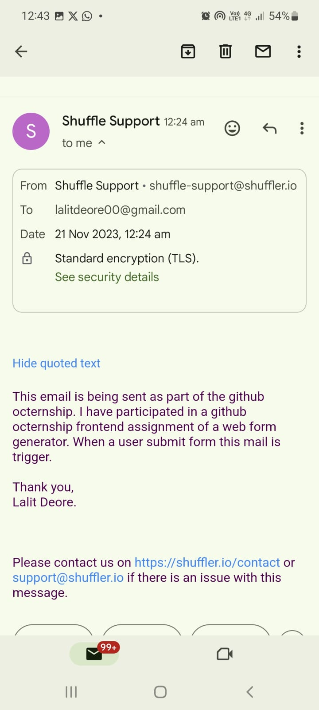

# Web Form Generator

Web Form Generator is a React application that allows users to create dynamic forms, generate unique form URLs, and collect submissions.

## Features

- **Dynamic Form Creation:** Easily add and customize form fields.
- **Form URL Generation:** Generate unique URLs for each form.
- **Submission Handling:** Collect and handle form submissions.
- **User Authentication:** Allow authenticated users to access and submit forms.

## Technologies Used

- React
- React Router
- Shuffle for triggering mail workflow inside shuffle
- Axios for HTTP requests
- CSS for styling
- node.js
- Express.js

## Code Details

- For front-end i have write code at shuffle/frontend/src/formGenerator. This folder include all code of form generator. Form generator home page is set at /FormGenerator path.
- For backend i have user node.js and express.js. Unique url is generated from backend and send it to the frontend and also work flow is trigger at backend. 

This is the home page. Here, users can add, and delete fields and bold, italic and underline field text. User can make field as required, can take input as file from user and also add multiple options for the input.

When user click on generate url a unique URL is generated from the backend. User can copy url by clicking copy button and share it with anyone. URL can be access anyone.

After add all required field user can preview form and if anything is missing than he can add field if required.

When user click on form link he will re-directed to the form and fill all the details of the form and submit form.

In shuffle i have created work flow when user submit form this work flow is trigger. Think work flow consist of web hook url https://shuffler.io/api/v1/hooks/webhook_5e6467a6-113b-49df-90d7-4e701fb0d328 when user click on submit button this web hook is trigger and this web hook further make request to send mail on hello@shuffler.io .

When user click on submit button it trigger work flow and form related data is stored inside the webhook JSON format.

This mail receive by triggering shuffle workflow. for this I have set my mail id. Further i have user updated shuffle mail id.

